# centreon-live-top10-metric-usage

## Purpose
this widget is here to provide you information regarding your most consuming servers. Should it be CPU, Memory, Load or whatever that could come to your mind. All you need, is to find your disired metric. 

## Installation
- head over your Centreon install dir
`cd /usr/share/centreon/www/widgets/`
- install git
`yum install git`
- clone this repository
`git clone https://github.com/tanguyvda/centreon-live-top10-metric-usage.git`
- Then, in your Centreon web interface, go to Administration -> Extensions -> widgets and install your new widget
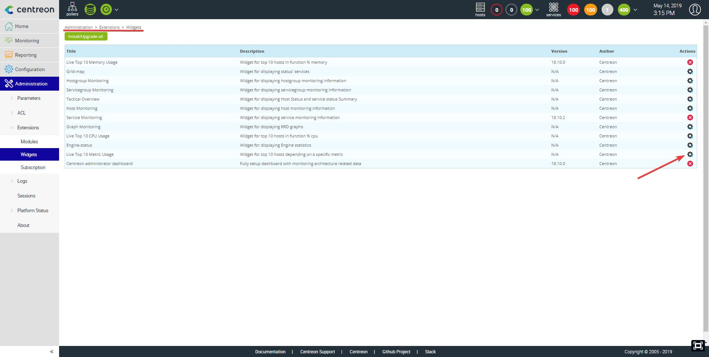

## Configuration
- head over the home menu and add your newly installed widget. 
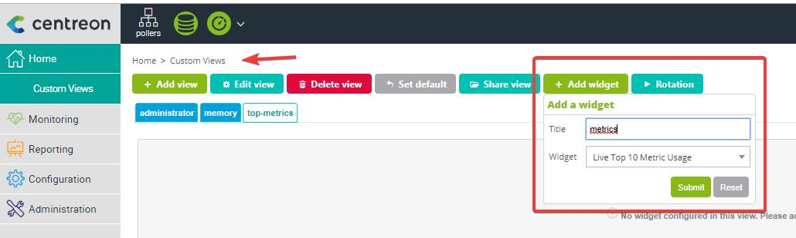

- set up the mandatory parameters
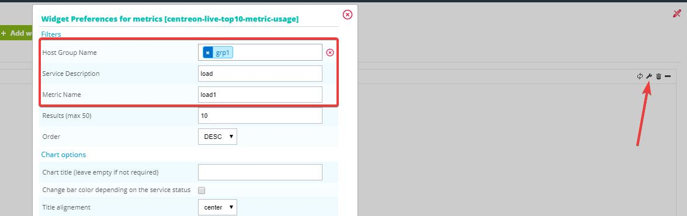

### Result
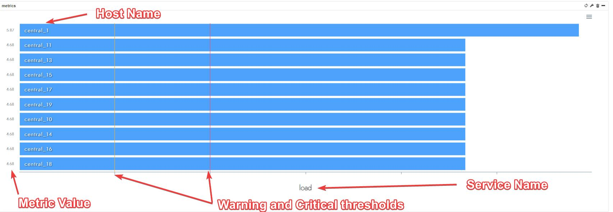

## Customization
This widget comes with a lot of options and this chapter is here to help you go through

### Chart Title
allows you to write your own title for the chart
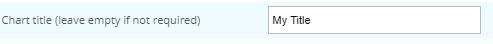
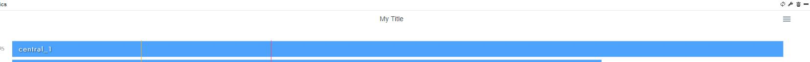

### Chart Subtitle
allows you to write your own subtitle for the chart
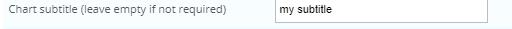
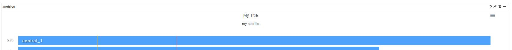

### Titles position
allows you to change the titles position (left, center or right)
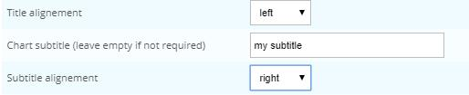
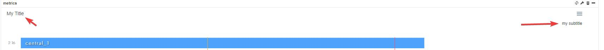

### Animations
you can disable the chart animation if you wish and change the animation effect
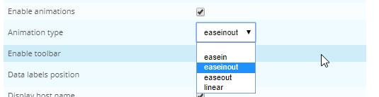

### Toolbar
you can disable the toolbar that allows you to save the chart in a PNG or SVG format
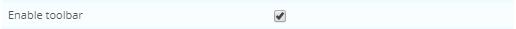
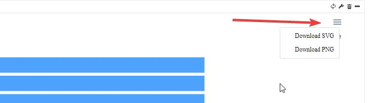

### 

